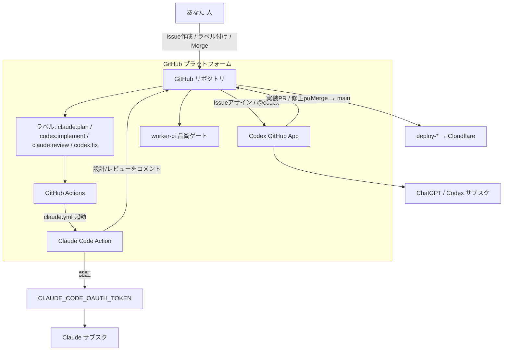

# AI開発基盤 運用マニュアル

Claude と Codex を GitHub Issue/PR 中心で併用するための運用マニュアル。
役割分担の詳細は [`CLAUDE.md`](../CLAUDE.md)、自動化の全体設計は
[`ai-development-workflow.md`](./ai-development-workflow.md) を参照。本書は
**「どう動くか・いくらかかるか・止め方・困ったとき」**をまとめた運用者向けの手引き。

> 注意: 料金・無料枠・各サービスの仕様は変わり得ます。金額は2026年6月時点の概算です。
> 重要な判断の前に各サービスの最新の料金ページで必ず確認してください。

---

## 1. 全体構成図

ひとことで言うと：
**人がIssueとラベルを置く → GitHubがトリガ → Claude(設計/レビュー)とCodex(実装/修正)が動く → 人がMergeするとCloudflareへ。**

---

## 2. Claude の役割

- **設計・タスク分解・レビュー**を担当（コードは書かない）。
- 起動経路：Issue/PR にラベル（`claude:plan` / `claude:review`）または `@claude` コメント。
- 実体：GitHub Actions 上で動く **Claude Code Action**（`.github/workflows/claude.yml`）。
- 権限：読み取り＋コメントのみ（`--allowedTools Read,Grep,Glob`）。push/merge はしない。
- 出力：Issue/PR への日本語コメント（ゴール・受け入れ条件・分解・安全制約・レビュー指摘）。

## 3. Codex の役割

- **実装・テスト作成・修正**を担当。
- 方式：**方式A = Codex GitHub App（クラウド連携）**。`OPENAI_API_KEY` も専用ワークフローも不要。
- 起動経路：Issue を Codex にアサイン／`@codex` コメント／`codex:implement`・`codex:fix` 運用。
- 出力：実装ブランチ＋PR、レビュー指摘への修正 push。
- 制約：`main` には触らない。設計判断・スコープ決定はしない（それは Claude/人）。

## 4. GitHub の役割

- **すべての履歴の置き場**（Issue・PR・コメント・レビュー）。運用の「正」はここ。
- リポジトリ構成：`origin = beckhamichan/line-harness-oss`（fork） / `upstream = Shudesu/line-harness-oss`（本家）。
- ラベルがAIの起動スイッチ：`claude:plan` / `codex:implement` / `claude:review` / `codex:fix`。
- マージは人の手動操作。`main` への反映＝デプロイのトリガになるため、最後の砦は人。

## 5. GitHub Actions の役割

- AIワークフローの**実行基盤**（Claude Code Action をホストする）。
- 既存の `worker-ci.yml`（typecheck→test→build）が**品質ゲート**。
- 現状 `GH_PAT` を入れていないため、**AI生成PRでは worker-ci が自動発火しない** →
  当面は手動実行（Actions → Worker CI → Run workflow、または対象ブランチへ軽微なcommit）。

---

## 6. Secrets 一覧

| 名前 | 用途 | 必須 | 現状 |
|---|---|---|---|
| `CLAUDE_CODE_OAUTH_TOKEN` | Claude Code Action の認証（Claudeサブスク利用） | ✅ | 未登録 |
| Codex GitHub App | Codex連携（方式A、Secretではなくアプリ連携） | ✅ | 未インストール |
| `GH_PAT` | AI生成PRでCIを自動連鎖させる | 任意 | 当面なし（手動運用） |
| `ANTHROPIC_API_KEY` | OAuthの代わりにAPI従量課金で動かす場合 | 不要 | 使わない方針 |
| `OPENAI_API_KEY` | Codexを方式B(CLI)で動かす場合 | 不要 | 方式Aなので不要 |
| (既存) `vars.LINE_HARNESS_CLOUDFLARE_DEPLOY` ほか | デプロイ系 | — | 既存のまま |

GitHub UI 設定（Secretではないが必要）：
- Actions の有効化（Settings → Actions → General）。
- Workflow permissions を「Read and write」＋「Allow GitHub Actions to create and approve PRs」。
- Issue 機能の有効化（fork は既定オフ。設定済み）。

---

## 7. 料金が発生する可能性がある箇所

| 箇所 | 課金の起き方 |
|---|---|
| Claude（`CLAUDE_CODE_OAUTH_TOKEN`） | **Claudeサブスク（Pro/Max）の利用枠を消費**。サブスク料金そのものが実質コスト。枠超過は追加課金ではなくレート制限で止まる（プラン依存） |
| Claude（`ANTHROPIC_API_KEY` を使う場合） | **トークン従量課金**。使うほど比例して請求。今回は採用しない方針 |
| Codex（ChatGPT/Codexサブスク） | **ChatGPTサブスク（Plus/Pro等）の利用枠を消費**。サブスク料金が実質コスト |
| GitHub Actions の実行時間 | **publicリポジトリは無料**。privateだと無料枠超過分が分単位課金 |
| Cloudflare デプロイ | Workers/Pages/D1 の各無料枠を超えると課金（AI基盤とは別軸の既存コスト） |

ポイント：**OAuthトークン方式なら「使った分だけ青天井に課金」は起きにくい**（サブスク枠＋レート制限モデル）。
API キー方式にすると従量課金になるので、コスト予測性を重視するなら今の方針が安全。

## 8. 無料で使える範囲

- **GitHub Actions**：このリポジトリは public なので、標準ランナーの実行時間は**無料・無制限**。
- **GitHub の Issue/PR/ラベル/コメント**：無料。
- **Claude / Codex のサブスク枠内**の利用：追加課金なし（枠を使い切ったらレート制限）。
- 結論：**新たに「従量課金のAPIキー」を登録しない限り、今の構成は手持ちサブスク代だけで回せる**。

## 9. 月額コストの目安

前提：API従量課金は使わず、OAuthトークン＋Codex Appのサブスク方式。

| 項目 | 目安/月 | 備考 |
|---|---|---|
| Claude サブスク | 既に契約中の額（例：Pro 約$20〜 / Max 上位プラン） | 追加発生なし。既存契約を流用 |
| ChatGPT/Codex サブスク | 既に契約中の額（例：Plus 約$20〜） | 追加発生なし。既存契約を流用 |
| GitHub Actions | **¥0** | public リポジトリのため |
| 追加の新規コスト | **実質 ¥0** | 新たな従量課金を入れない限り |

→ **AI開発基盤として新たに増える固定費はほぼゼロ**。既存のClaude/ChatGPTサブスクの範囲で運用する想定。
利用が重くサブスク枠で足りない場合のみ、上位プランやAPI従量課金を検討する。

---

## 10. 停止方法

段階的に止められる。軽い順から。

1. **一時停止（ラベルを付けない）**：起動はラベル/メンション駆動。付けなければ何も動かない。
2. **ワークフロー単体を無効化**：GitHub → Actions → 「Claude」ワークフロー → `...` → Disable workflow。
3. **Codexを止める**：Issueのアサインを外す／`@codex` を使わない。完全停止はCodex GitHub Appをアンインストール。
4. **認証を切る**：`CLAUDE_CODE_OAUTH_TOKEN` を削除すればClaude Actionは認証エラーで動かなくなる。
5. **Actions全体を止める**：Settings → Actions → General → Actions permissions を Disable。
6. **完全撤去**：`.github/workflows/claude.yml` を削除するPRを出してMerge。

緊急時の最短手順：**Actionsを Disable** か **トークン削除**。これでAI起動は即止まる。
（デプロイを止めたい場合は別途 `deploy-*` ワークフローを Disable。）

---

## 11. トラブル時の切り分け

| 症状 | 最初に見る場所 | よくある原因 |
|---|---|---|
| ラベルを付けてもClaudeが反応しない | Actions タブの実行履歴 | ① Actions無効 ② `CLAUDE_CODE_OAUTH_TOKEN` 未登録/失効 ③ ラベル名のタイプミス |
| Actionは走るが認証エラー | 当該ジョブのログ | トークン未登録/期限切れ → 再発行して登録し直し |
| Claudeがコメントを書けない | ジョブログの権限エラー | Workflow permissions が Read のまま → Read and write に変更 |
| Codexが実装PRを作らない | Issueのアサイン/連携状態 | Codex App 未インストール／アサイン漏れ |
| 実装PRでCIが回らない | PRのChecks欄 | `GH_PAT` 未導入のため自動発火しない仕様（手動実行で対応） |
| CIは赤いが原因不明 | worker-ci のログ | typecheck/test の失敗 → Codexに `@codex fix` |
| 意図せずデプロイされた | deploy-* のログ | `main` へMergeした＝正常動作。配信安全側の確認を優先 |

切り分けの基本順序：**Actionが起動したか → 認証が通ったか → 権限があるか → 中身（lint/test）か**。
まず Actions タブのログを開くのが最短。

---

## 12. 将来「完全自動化」する場合のロードマップ

現状は**人がラベルとMergeを握る半自動**。安全を保ちつつ自動化度を上げる段階案。

- **フェーズ0（現在）**：人がラベル付け＋Merge。CIは手動確認。最も安全。
- **フェーズ1：CI自動化**
  - `GH_PAT`（またはGitHub App トークン）を導入し、AI生成PRで `worker-ci` を自動発火。
  - 手動CIの手間がなくなる。
- **フェーズ2：トリガ簡素化**
  - `claude:plan`→`codex:implement` を自動連鎖（planコメント完了で自動ラベル付与）。
  - 人の操作を「Issue作成」と「Merge」だけに圧縮。
- **フェーズ3：品質ゲート強化**
  - Branch protection（CI緑＋レビュー必須）を `main` に設定。
  - 配信安全テスト（`scenario-schedule.test.ts` 系）を必須チェック化。
- **フェーズ4：条件付きオートマージ**
  - `docs:` など低リスク変更に限り、CI緑＋Claudeレビューpassで自動マージ。
  - **配信ロジック・DBスキーマ・秘密情報に触るPRは必ず人間Mergeのまま残す**（絶対条件）。
- **フェーズ5：監視と通知**
  - 失敗・異常配信の通知（Discord/メール）を整備し、無人運転の安全網を作る。

原則：**自動化度を上げても「配信安全(21:00〜8:00禁止)・二重送信・秘密情報」に関わる変更は最後まで人間が承認する**。
速度より安全を優先（CLAUDE.md / CONTRIBUTING.md と同じ思想）。

---

## 付録：関連ドキュメント

- 役割分担と開発ルール：[`CLAUDE.md`](../CLAUDE.md)
- 自動化の全体設計：[`ai-development-workflow.md`](./ai-development-workflow.md)
- 貢献・安全ポリシー：[`CONTRIBUTING.md`](../CONTRIBUTING.md)
- 実装AI向け方針：[`AGENTS.md`](../AGENTS.md)
