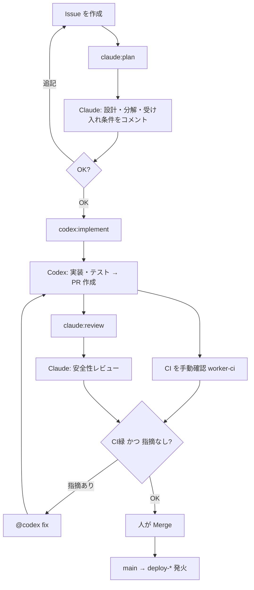

# AI 開発ワークフロー（Claude × Codex）

GitHub Issue を1つ作るだけで、Claude と Codex が役割分担して開発を進めるための運用設計。
詳細な役割分担・安全ルールは [`CLAUDE.md`](../CLAUDE.md) を正とする。本書は「自動化の全体像」を示す。

## 役割分担

- **Claude（Claude Code GitHub Action）** … 設計・タスク分解・レビュー。コードは書かず Issue/PR にコメントで残す。
- **Codex（Codex GitHub App / 方式A）** … 実装・テスト作成・修正。plan 確定後に PR を作る。
- **あなた（人）** … Issue 作成、ラベル付け、最終 Merge。

## 前提構成（このリポジトリの決定事項）

- Codex は **方式A：Codex GitHub App（クラウド連携）** を使う。`OPENAI_API_KEY` も `codex.yml` も不要。
- Claude 認証は **`CLAUDE_CODE_OAUTH_TOKEN`**（Claude サブスク）を使う。
- **`GH_PAT` は当面入れない。** そのため AI が作成した PR では `worker-ci` が自動発火しない。
  → CI は当面 **手動確認**（下記「CI の手動確認」参照）。
- AI は `main` に直接 push しない。デプロイ（`deploy-*`）は人が PR を Merge した時だけ発火する。

## 運用フロー

1. Issue を1つ作る（やりたいこと・背景を書く）。
2. `claude:plan` を付ける → Claude が設計・受け入れ条件・タスク分解をコメント。
3. 内容を確認。OK なら `codex:implement` を付ける → Codex が実装＋テストして PR を作成。
4. **CI を手動確認**（後述）。
5. PR に `claude:review` を付ける → Claude が安全性・設計をレビュー。
6. 指摘があれば PR に `@codex fix` → Codex が修正を push。4〜6 を必要回数ループ。
7. あなたが最終確認して Merge → `main` → 既存 `deploy-*` が発火。

## CI の手動確認（GH_PAT 未導入のあいだ）

AI 生成 PR では `worker-ci` が自動で回らないため、次のいずれかで手動実行する。

- GitHub の **Actions → Worker CI → Run workflow** で対象ブランチを指定して実行（`worker-ci.yml` は `workflow_dispatch` 対応済み）。
- もしくは対象ブランチに自分で軽微な commit を1つ push して `pull_request` を起こす。
- もしくはローカルで `pnpm --filter worker typecheck && pnpm --filter worker test`。

将来 `GH_PAT`（または GitHub App トークン）を入れれば、この手動確認は不要になり PR で自動発火するようになる。

## 安全制約（レビューで必ず見る点）

- **配信禁止時間帯 JST 21:00〜翌8:00**（`packages/db/src/scenario-schedule.ts` の `clampToDeliveryWindow`）。
- 二重送信・誤アカウント送信・大量誤送信を生まないこと。
- トークン／チャネルシークレット／アカウントID／顧客データを差分・コメントに含めないこと。

## ラベル一覧

| ラベル | 付ける対象 | 意味・起動するもの |
|---|---|---|
| `claude:plan` | Issue | Claude が設計・タスク分解する |
| `codex:implement` | Issue | Codex が実装して PR を作る（plan 確定後に付ける） |
| `claude:review` | PR | Claude が差分をレビューする |
| `codex:fix` | PR | Codex が指摘・失敗テストを直す（`@codex fix` でも可） |

## 必要な Secrets / 設定

| 名前 | 用途 | 状態 |
|---|---|---|
| `CLAUDE_CODE_OAUTH_TOKEN` | Claude Code Action 認証 | **要登録** |
| Codex GitHub App | Codex 連携（方式A） | **要インストール** |
| `GH_PAT` | AI-PR で CI を自動連鎖させる | 当面なし（手動運用） |
| Actions の Workflow permissions | Read/write・PR作成許可 | **要有効化** |

## ワークフロー一覧

| ファイル | 状態 | トリガ | 役割 |
|---|---|---|---|
| `claude.yml` | 新規 | Issue/PR の label・`@claude` コメント | Claude の plan / review |
| `worker-ci.yml` | 既存 | `pull_request` / `workflow_dispatch` | 品質ゲート（当面は手動実行） |
| Codex（方式A） | App | Issue アサイン / `@codex` | 実装・修正（ワークフロー不要） |

## 全体フロー図

